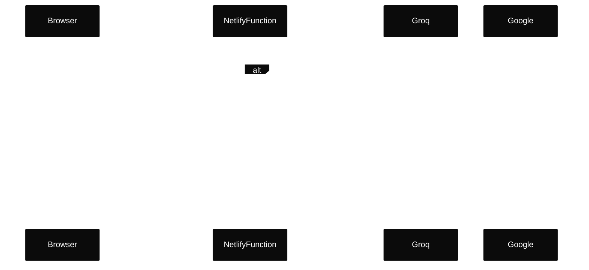

# Netlify Function LLM Proxy (Groq + Google)

## Goal

Add a **server-side** LLM endpoint (Netlify **Functions**, Node runtime) that can call **Groq** and **Google** through the Vercel AI SDK, without exposing API keys to the browser. Then do a minimal frontend `fetch()` and `console.log()` of the response.

## Current repo context

- Netlify is configured in [`netlify.toml`](../../netlify.toml):
  - Build: `yarn build`
  - Dev: `yarn dev:vite` behind `netlify dev`
  - Edge Functions live in `netlify/edge-functions/` (e.g. `netlify/edge-functions/employer-auth.ts`)

## Architecture

- **Browser** sends `POST` JSON to a Netlify **Node Function**
- **Node Function** calls `generateText()` with either:
  - `groq('llama-3.1-8b-instant')`
  - `google('gemini-1.5-flash')`
- Function returns JSON: `{ provider, text }`



## Backend: create the Netlify Function (Node)

1. Add a Functions directory config to [`netlify.toml`](../../netlify.toml):

- Add:
  - `[functions]`
  - `directory = "netlify/functions"`

2. Create `netlify/functions/llm.ts`:

- **Method**: `POST` only
- **Request JSON**: `{ provider: 'groq' | 'google', prompt: string }`
- **Response JSON**: `{ provider: string, text: string }`
- **Model routing**:
  - Groq: `groq('llama-3.1-8b-instant')`
  - Google: `google('gemini-1.5-flash')`

### Security hardening (must-have in todo 1)

Implement these in `netlify/functions/llm.ts` from day 1:

1. **Require the gate cookie and verify it server-side**

- Read `Cookie` header and require `pf_employer_session` to be present.
- Verify the token using the same scheme as [`netlify/edge-functions/employer-auth.ts`](../../netlify/edge-functions/employer-auth.ts) with `EMPLOYER_SESSION_SECRET`:
  - Token format: `payloadB64.sigB64`
  - Signature: HMAC-SHA256 over `payloadB64`
  - Payload JSON includes `exp`/`iat` and must not be expired
- If missing/invalid/expired: return **401**.

2. **Require `Origin` header to be in an allowlist**

- Reject requests with no `Origin` (return **403**).
- Allow only configured origins, e.g. reuse `EMPLOYER_ALLOWED_ORIGINS` (comma-separated) or define a dedicated `LLM_ALLOWED_ORIGINS`.

3. **Request validation + limits (cost control)**

- Enforce `Content-Type: application/json`.
- Validate `provider` is exactly `'groq'` or `'google'`.
- Validate `prompt` is a string and apply a max length (e.g. 2k–8k chars). Reject oversize prompts with **413** or **400**.
- (Optional) enforce timeouts on upstream LLM calls and return a sanitized **504/500**.

4. **Rate limit (brute-force / quota drain)**

- Implement a minimal rate limiter keyed by **session** (from the gate cookie) and optionally IP.
  - Example: fixed window like 30 requests / 5 minutes per session.
- Note: in-memory rate limiting is “best effort” (resets on cold start). For stronger guarantees, plan for an external store later.

## Errors

If any of those fail, you’ll see:
401 (missing/invalid cookie),
403 (missing/not-allowed Origin),
415/400/413 (content-type / JSON / prompt limits),
429 (rate limit).

5. **Logging + error hygiene**

- Do not log full prompts or request bodies.
- Return sanitized errors (no upstream stack traces or raw provider error dumps).
- Avoid echoing user input back in error messages.

6. **Output safety**

- Treat model output as untrusted text.
- Return JSON with `text` only; on the frontend, render as plain text (no `dangerouslySetInnerHTML`).

## Dependencies (Yarn)

Ensure:

- `ai`
- `@ai-sdk/groq`
- `@ai-sdk/google`

Optional (TypeScript handler types):

- `@netlify/functions` (devDependency)

## Environment variables (server-side only)

Set these locally for `netlify dev` and in Netlify site settings:

- `GROQ_API_KEY`
- `GOOGLE_GENERATIVE_AI_API_KEY`

Do **not** expose either to the browser (avoid `VITE_` prefixes).

## Frontend: minimal test case (console.log)

Call the function from the client (any React component / temporary button is fine):

Groq request:

```ts
const res = await fetch('/.netlify/functions/llm', {
  method: 'POST',
  headers: { 'content-type': 'application/json' },
  credentials: 'include', // send gate cookie
  body: JSON.stringify({
    provider: 'groq',
    prompt: 'Tell me about yourself in 3 sentences.',
  }),
});
console.log(await res.json());
```

Google request (same endpoint, different provider):

```ts
const res = await fetch('/.netlify/functions/llm', {
  method: 'POST',
  headers: { 'content-type': 'application/json' },
  credentials: 'include', // send gate cookie
  body: JSON.stringify({
    provider: 'google',
    prompt: 'Tell me about yourself in 3 sentences.',
  }),
});
console.log(await res.json());
```

## Verify locally

1. Run:

- `yarn dev` (Netlify dev per [`netlify.toml`](../../netlify.toml))

2. Confirm:

- Both providers return JSON `{ provider, text }`
- No API keys appear in the browser bundle or network responses

## Verify after deploy

1. Deploy to Netlify
2. Test endpoint:

- `https://<site>/.netlify/functions/llm`
